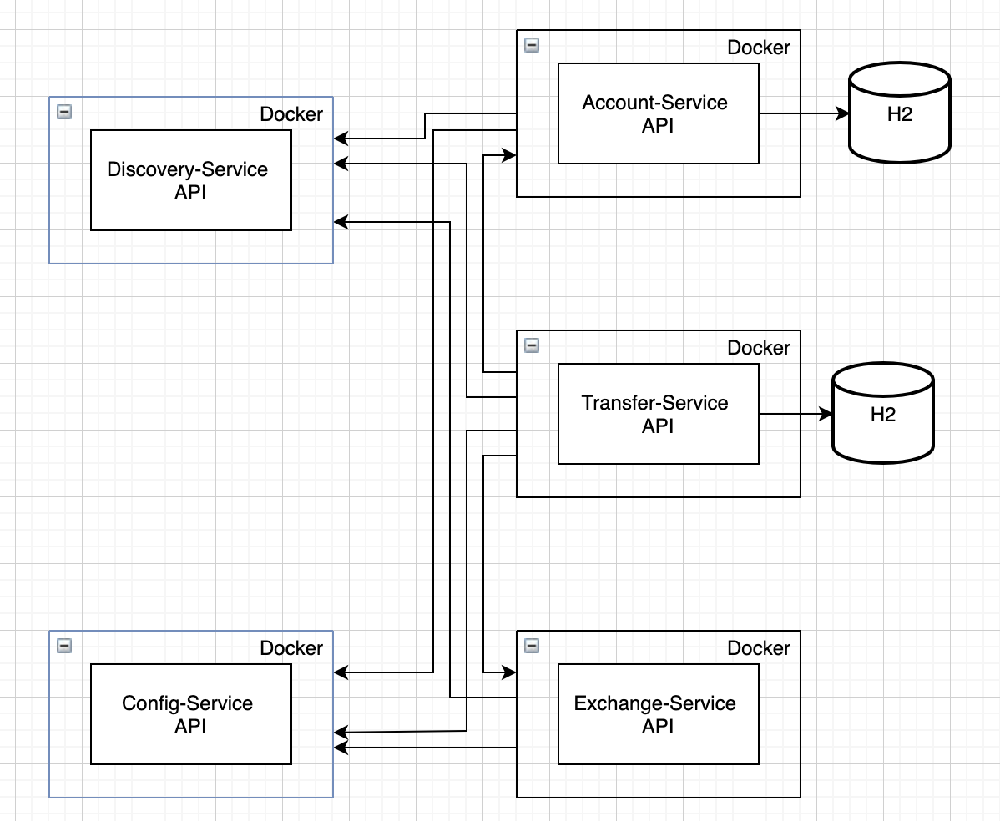
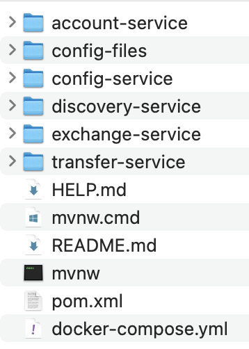

## Index
1. [Introduction](#introduction)
2. [Archetecture](#achitecture)
3. [Project Structure](#project-structure)
4. [Build And Run](#build-and-run)
4. [Testing](#testing)
4. [Using the APIs](#usgin-the-apis)
    1. [Transfer Service API](#transfer-service-api)
    1. [Account Service API](#account-service-api)
        1. [Create Account](#create-account)
        1. [Find Account](#find-account)
        1. [Debit Funds](#debit-funds)
        1. [Credit Funds](#credit-funds)
    1. [Exchange Service API](#exchange-service-api)
        1. [Convert](#convert)
4. [Enhancements](#enhancements)
5. [Known Issues](#known-issues)

## Introduction

The project's general goal is move money from an account to other account using microservices. To do it, I decided to use Spring Boot, Maven, Docker, [Cucumber](https://cucumber.io/), JUnit, and other dependencies. I implemented three micreoservices which each of them holds an specifict business unit -Transfers, Accounts and Rates Exchange. Furthermore, I implemented two additional microservices one for discoverability and one to store and serve the configs used by each microservice.

## Architecture



There are a total of five microservices and each API is using a Docker images.

- **Transfer-Service**
  In charge of handle requests for transfer funds from an account to another. Furthermore, it consumes the Account-Services and Exchange-Service to update the account's balance and change the tax currency respectively. Also, it stores the transfer request and result.
- **Account-Service**
  In charge of handle requests related to the account i.e. creates accounts and credit and debit from the account's balance. Furthermore, it stores the account data in an H2 database.
- **Exchange-Service**
  In charge of exchange an amount of money from a currency to another one. It calls http://api.exchangeratesapi.io/ to get the current rate value for a determined currency and uses that value to convert the given value to its equivalent value in another currency.
- **Discovery-Service**
  Uses Netflix Eureka to make it easy for each API to find each other. It implements the Spring Cloud with Netflix Eureka integration dependency.
- **Config-Service**
  API in charge of providing the config files to the other APIs. It implements the Spring Cloud Config Server dependency.

## Project Structure

The image below shows the project structure.



Although the APIs are in the same maven project and directory they run independently. I decided to hold all the APIs' sources under the same directory for agility at development time. Thus, if you need to run a specific API you should put yourself in the source directory and run `mvn spring-bot:run`.

## Build and Run

> Due to the docker and docker-compose are failing on the start-up time -I'm trying to figure out what is happening- we need to run all the APIs manually.

We need to be inside each APIs' source directory to be able to run the following commands.

***Note: the execution order is important. First, we must run `discovery-service` and then `config-service`. Then, we can start-up the other APIs.***

 ```bash
 mvn clean package
 ```

and

 ```bash
 mvn spring-boot:run
 ```

On the `account-service` startup two account will be created por testing and with the following information

|account|accountBalance|
|--|--|
|111222333|100000.00|
|444555666|70000.00|

## Testing

Unfortunately the only project that have unit and integration tests is `transfer-service`. You can run them with the next command.

```bash
mvn clean test
```

***Note: Remember that you need to be under the `transfer-service` directory.***

The Cucumber Feature file holds the integration test. This file is located at `funds-transfer/transfer-service/src/test/resources/features/TransferFunds.feature`

The cucumber report can be found at `funds-transfer/transfer-service/target/cucumber-reports.html`.

And, the Jacoco report at `funds-transfer/transfer-service/target/site/jacoco/index.html`

## Using the APIs

### Transfer Service API

The `transfer-service` API has only one endpoint which is used to perform a transfer of funds.

```bash
curl --location --request POST 'localhost:8080/' \
--header 'Content-Type: application/json' \
--data-raw '{
    "amount": 5000.0,
    "currency": "USD",
    "origin_account": "111222333",
    "destination_account": "444555666",
    "description": "Hey dude! I am sending you the money you loaned to me last week"
}'
````

> I worked more on this service. There you can find some integration and unit tests and a coverage report with Jacoco.

### Account Service API

The `account-service` API has four endponts.

#### Create Account

To call the create account endpoint execute the next command.

```bash
curl --location --request POST 'http://localhost:8082/account/create' \
--header 'Content-Type: application/json' \
--data-raw '{
    "account": "11223344",
    "account_balance": 50000.00
}'
````

#### Find Account

To call the find account endpoint execute the next command.

```bash
curl --location --request POST 'http://localhost:8082/account/find' \
--header 'Content-Type: application/json' \
--data-raw '{
    "account": "111222333"
}'
````


#### Debit Funds

To call the debit funds endpoint execute the next command.

```bash
curl --location --request POST 'http://localhost:8082/account/debit' \
--header 'Content-Type: application/json' \
--data-raw '{
    "account": "111222333",
    "amount": 1000.00
}'
````

#### Credit Funds

To call the credit funds endpoint execute the next command.

```bash
curl --location --request POST 'http://localhost:8082/account/credit' \
--header 'Content-Type: application/json' \
--data-raw '{
    "account": "111222333",
    "amount": 1000.00
}'
````

### Exchange Service API

The `exchange-service` only has an endpint to exchange an amount of money to other.

> So far this API only can convert from USD to CAD currencies

#### Convert

To call the the convert endpoint execute the next command.

```bash
curl --location --request GET 'localhost:8084/exchange/convert?source=USD&output=CAD&value=1000.00'
````

> The service needs a Access Key provided by https://exchangeratesapi.io/. This access key needs to be placed on the `config-service/exchange-service.properties` file.

## Enhancements

The following list contains some ideas to enhance the application.

- The code can be refactored. There are duplicated code and not clear enough.
- There is not enough code documented
- Improve fields validation.
- Implement a better Exception handler.
- Enhance the responses based on the exceptions thrown by the APIs.
- Take advantage of the HTTP Status Codes to enhance the different kind of responses
- Use [JWT](https://jwt.io/) to protect the endpoints.
- Documentation with [Swagger](https://swagger.io/specification/).
- Hide endpoints that a user does not need to call such as account-service's debit and credi endpoints.
- Implement more unit and integration test using Cucumber y Junit
- Implement on all APIs [Jacoco](https://github.com/jacoco/jacoco) to measure the test coverage - currently implemented just on `transfer-service`.

## Known Issues

These are some known issues that I'd like to fix.

- There aren't enough unit and integration tests.
- The dependency [dockerfile-maven](https://github.com/spotify/dockerfile-maven) does not work. I guess is because there are some extra configurations to do on an macbook with M1.
- Docker compose cannot init the containers. I guess is because the same previous problem.
- There isn't a propper way to handle exceptions.
- Can be create accounts duplicated. The db is missing some constraints to avoid this.
- Despite implementing [Netflix Eureka](https://github.com/spring-cloud/spring-cloud-netflix), it isn't completelly functional and implemented at APIs.